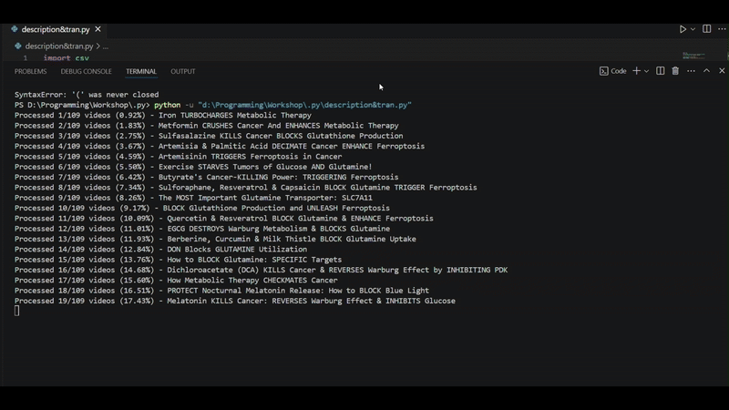

# 📌 YouTube Data Extractor


## 🎯 Overview
The **YouTube Data Extractor** is a powerful tool designed to retrieve structured data from YouTube videos and channels using the **official YouTube API**. This tool enables users to extract key information such as **video titles, URLs, comments, and transcripts** efficiently and in compliance with YouTube’s policies.

## 🚀 Features
- ✅ **Extract Video Titles & URLs** from a YouTube channel.
- ✅ **Retrieve Public Comments** from any video.
- ✅ **Extract Video Transcripts** (if available).
- ✅ **Save Data in Multiple Formats** (CSV, JSON, Excel).
- ✅ **Fully API-Based & Compliant** with YouTube’s Terms of Service.
- ✅ **Track Progress** and Handle Interruptions Gracefully.

## 🏃 Usage
### Extract Video Titles & URLs
```bash
python extract_videos.py --channel_id YOUR_CHANNEL_ID
```

### Extract Comments from a Video
```bash
python extract_comments.py --video_id YOUR_VIDEO_ID
```

### Extract Transcripts
```bash
python extract_transcripts.py --video_id YOUR_VIDEO_ID
```

### Stop Execution Gracefully
Press `Ctrl + C` anytime to interrupt the process without data loss.

## 📂 Output Formats


The extracted data is saved in:
- **CSV (`.csv`)** – For spreadsheet applications
- **JSON (`.json`)** – For developers & APIs
- **Excel (`.xlsx`)** – For detailed data analysis

## 📜 License
This project is licensed under the **MIT License** – see the [LICENSE](LICENSE) file for details.

## 🤝 Contributing
Pull requests are welcome! If you'd like to contribute, please follow these steps:
1. Fork the repository.
2. Create a new branch (`git checkout -b feature-name`).
3. Commit your changes (`git commit -m 'Add new feature'`).
4. Push to the branch (`git push origin feature-name`).
5. Open a pull request.

## 📬 Contact
For support or collaboration, reach out via:
- **Email:** ahmedamostafa03@gmail.com
- **GitHub Issues:** [Open an Issue](https://github.com/MatMan04/Extract-Transcript/issues)

---

🚀 **Enjoy extracting YouTube data efficiently and ethically!**
 
